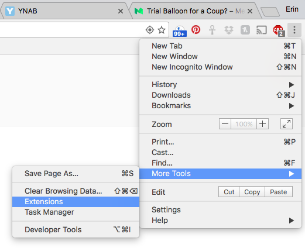
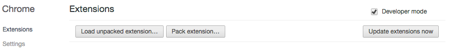
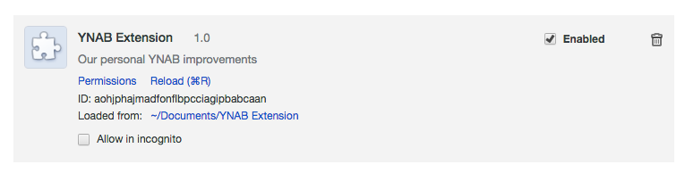

# YNAB Chrome Extension Installation

1) Clone the repository locally using Git

2) Open the extensions window in Chrome

3) Make sure developer mode is checked and click Load Unpacked Extension

4) Browse to your project folder and select the repository folder

5) The extension should now be listed in your Chrome extensions area. If you update or make changes to the extension, you must click reload to have them take effect.

